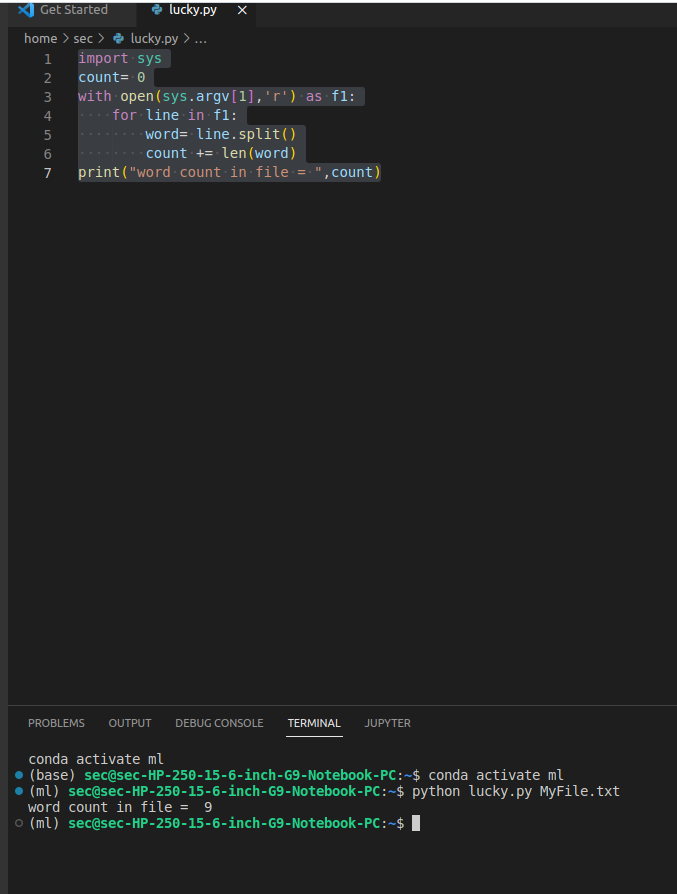

# command-line-arguments-to-count-word
## AIM:
To write a python program for getting the word count from the contents of a file using command line arguments.
## EQUIPEMENT'S REQUIRED: 
PC
Anaconda - Python 3.7
## ALGORITHM: 
#### Step 1:
Import sys libraray using import command.

#### Step 2:
Assign a empty dictionary to a variable.

#### Step 3:
Open the text file using command "with open(sys.argv[index]).

#### Step 4:
Read the lines in the file using for using.Using for loop, read every word in a line.

#### Step 5:
If the word is not in the empty dictionary,print 1 to the word.Else , increase by 1.

#### Step 6:
Print the changed empty dictionary and close the file.

## PROGRAM:
```python
''' 
Program to count the words from a file using command line arguments
Developed by: YOHESH KUMAR R.M
RegisterNumber: 22008459
'''
import sys
fp=open(sys.argv[1],"r")
d={}
for i in fp:
    for w in i.split():
        if w not in d.keys(): 
            d[w]=1
        else:
            d[w]+=1
print(d)    
```
### OUTPUT:



## RESULT:
Thus the program is written to find the word count from the contents of a file using command line arguments.
